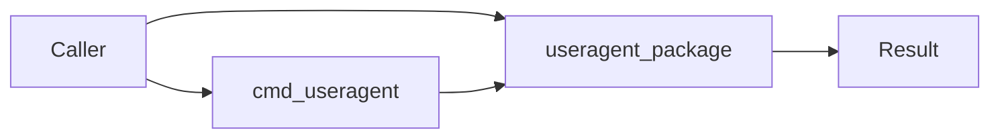
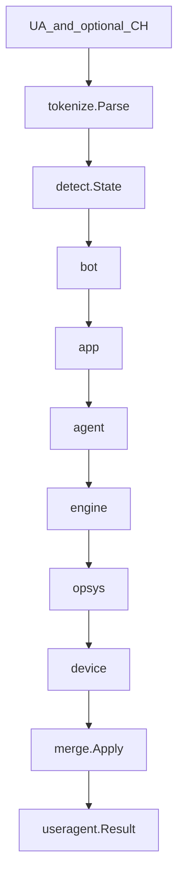
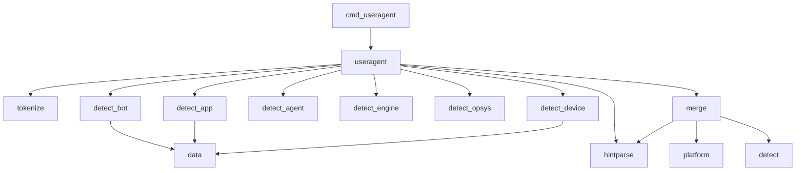
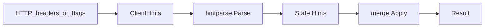

# User-Agent architecture

This document gives the high-level system architecture of the user-agent Go
library and CLI.

## Purpose and scope

This module analyzes HTTP **User-Agent** strings and optional User-Agent
**Client Hints** (`Sec-CH-UA*`) into structured details about the device,
operating system, layout engine, and agent. Callers use the public
`useragent` package; a thin CLI wraps the same API for local reproduction.

This file covers:

- The package map and dependency direction
- The analysis pipeline from UA (+ hints) to `Result`
- Embedded pattern catalog ownership and matching rules
- Client Hints parse and merge semantics
- CLI wiring and exit codes
- Invariants agents must not break

This file does **not** cover:

- Full usage examples and API tables — see [README.md](../../README.md)
- Pattern edit procedure — see [patterns-catalog](../skills/patterns-catalog/SKILL.md)
- Client Hints authoring details — see [client-hints](../skills/client-hints/SKILL.md)
- Pipeline extension checklist — see [ua-detection-pipeline](../skills/ua-detection-pipeline/SKILL.md)
- Agent index — see [AGENTS.md](../../AGENTS.md)

## System context

Callers import `github.com/deangrant/user-agent/useragent` or run the
`useragent` CLI. Analysis is in-process: tokenize the UA, run detectors, merge
Client Hints, and return a `Result`. There is no network egress, server, or
daemon.

The module is Go 1.26+ (`go.mod` pins the toolchain) and **stdlib-only**. There
are no third-party `require` entries.



## High-level analysis pipeline

[`useragent/useragent.go`](../../useragent/useragent.go) is the composition
root. `Analyzer.ParseWithHints` runs these steps:

1. Build `detect.State` with the raw UA string.
2. Tokenize via `tokenize.Parse(ua)` into products and comments.
3. Attach Client Hints as `hintparse.Hints` (`hintsToInternal`).
4. Run detectors in order: bot → app → agent → engine → opsys → device.
5. Call `merge.Apply(state)` to overlay CH and finalize derived strings.
6. Map state to public `Result` (`resultFromState`).

Package-level `Parse`, `ParseWithHints`, `ParseHeaders`, and `ParseRequest`
use a shared default `Analyzer` (`sync.Once`). A nil `Analyzer` receiver is
treated as `NewAnalyzer()`.



## Package map

| Package | Role |
| ------- | ---- |
| `useragent` | Public API: `Analyzer`, `Parse*`, `Result`, `ClientHints` |
| `cmd/useragent` | CLI composition root: flags, headers, JSON output, exit codes |
| `internal/detect` | `State`, `Detector` contract, shared helpers |
| `internal/detect/bot` | Robots, crawlers, HTTP clients, hackers |
| `internal/detect/app` | In-app browsers and applications |
| `internal/detect/agent` | Browser / agent identity from tokens |
| `internal/detect/engine` | Layout engine (may read `AgentName`) |
| `internal/detect/opsys` | Operating system (name avoids stdlib `os`) |
| `internal/detect/device` | Device class, brand, model |
| `internal/data` | Embeds and loads `patterns.json` |
| `internal/tokenize` | UA product/comment tokenization |
| `internal/hintparse` | RFC 8941 structured-field **subset** for Sec-CH-UA* |
| `internal/merge` | Client Hints overlay and derived field finalization |
| `internal/platform` | Windows NT / CH platform → OS version mapping |
| `internal/uaclass` | Shared class string constants |
| `internal/version` | Version compare, major extraction, normalization |

Do not put detection business logic in `cmd`. Wire the detector pipeline only
in `useragent`. Do not create `detect` → subpackage → `detect` import cycles.
Detector subpackages must not import each other.



## Patterns catalog

The default catalog is embedded from
[`internal/data/patterns.json`](../../internal/data/patterns.json) via
[`internal/data/data.go`](../../internal/data/data.go) (`//go:embed`). Rebuild
or re-test after catalog edits so the embed is exercised.

`data.Load` / `MustLoad` unmarshals into `Catalog{Bots, Apps, Brands}`.

| Section | Consumer | Matching |
| ------- | -------- | -------- |
| `bots` | `internal/detect/bot` | Case-insensitive substring; first non-heuristic hit wins; `heuristic: true` also requires `looksLikeBot` |
| `apps` | `internal/detect/app` | Substring needle, or `(?i)` regexp when the pattern contains `.*`; skipped when `BotMatched` |
| `brands` | `internal/detect/device` | Token-boundary `prefix` (preferred) or `pattern`; JSON order matters for overlapping keys |

Prefer specific tokens over short English words. Every catalog change needs a
table-driven test in the owning detector package.

See [`.agents/rules/patterns-catalog.mdc`](../rules/patterns-catalog.mdc) and
[patterns-catalog](../skills/patterns-catalog/SKILL.md).

## Detectors

Each detector implements `detect.Detector` (`Detect(state *State)`). Detectors
fill **empty** fields unless they own the concern.

Order couplings that agents must preserve:

- **bot before app** — bots win; app returns early when `BotMatched`
- **agent before engine** — Blink and related paths may read `AgentName`
- **opsys before device** — device classification may read OS fields

| Detector | Source of truth |
| -------- | --------------- |
| bot / app / device brands | Embedded `patterns.json` |
| agent / engine / opsys | In-code rules on tokens and comments |
| device class heuristics | In-code rules plus brand table |

Shared mutable scratchpad: [`internal/detect/detect.go`](../../internal/detect/detect.go)
(`State`). Public output mapping lives in `useragent` (`Result` and nested
types in `result.go`).

See [ua-detection-pipeline](../skills/ua-detection-pipeline/SKILL.md).

## Client Hints

Ingestion path:

1. `ClientHintsFromHeader` / `ClientHintsFromMap` (public types in
   [`useragent/hints.go`](../../useragent/hints.go))
2. `hintparse.Parse` — RFC 8941 subset (lists, sf-strings, tokens, booleans)
3. Stored on `State.Hints` before detectors run
4. Detectors use the UA; they do not replace the merge step
5. `merge.Apply` overlays agent, OS, device, and CPU fields, then finalizes
   derived `*NameVersion*` strings

Merge highlights ([`internal/merge/merge.go`](../../internal/merge/merge.go)):

- Prefer Full-Version-List over Sec-CH-UA brands; `SignificantBrand` skips
  GREASE / “Not A;Brand”
- Frozen Chromium UA versions (`X.0.0.0`) yield to richer CH versions
- OS **family** conflict (e.g. Android UA + Windows CH) sets
  `ClientHintsMismatch` and **keeps** UA-derived OS fields
- Windows CH platform-version major **≥ 13** maps to Windows 11
  (`internal/platform`)
- Preserve UA `iPadOS` when CH reports broader `iOS`

See [`.agents/rules/client-hints-merge.mdc`](../rules/client-hints-merge.mdc)
and [client-hints](../skills/client-hints/SKILL.md).



## CLI

[`cmd/useragent`](../../cmd/useragent) exposes `parse`:

- Positional UA string, or `-` to read MIME-style headers from stdin
- Optional `-sec-ch-*` flags applied onto headers before `ParseHeaders`
- `-json` / `-compact` for machine-readable `Result` output
- UA length cap 8 KiB; stdin header input cap 64 KiB

Reproduce locally with `/parse-ua` or:

```bash
go run ./cmd/useragent parse -json '<ua>'
```

## Errors and contracts

| Exit code | When |
| --------- | ---- |
| `0` | Success, or help (`-h` / `help`) |
| `2` | Usage errors (`usageError`: missing subcommand, bad args) |
| `1` | Other runtime failures (e.g. oversized UA, header parse errors) |

Invariants agents must not break without an explicit product decision:

- Keep the module **stdlib-only** (no third-party `go.mod` requires).
- Preserve detector order: bot → app → agent → engine → opsys → device → merge.
- Wire the pipeline only in `useragent`; keep business logic out of `cmd`.
- Keep `detect.Detector` as a single `Detect` method; no speculative interfaces.
- On OS family mismatch, set `ClientHintsMismatch` and do not overwrite UA OS.
- Do not invent a full RFC 8941 library; extend the existing `hintparse` subset.

## Verification and agent layout

Local verify (CI parity):

```bash
go test ./...
golangci-lint run ./...
```

Race tests in CI:

```bash
go test ./... -race -count=1
```

See [`/verify`](../commands/verify.md).

CI workflows under [`.github/workflows/`](../../.github/workflows/):

- `go-test.yml` — build `./...`, race tests, govulncheck
- `golangci-lint.yml` — format diff and lint

Agent support lives under `.agents/`:

- `rules/` — stdlib-only, Go style/SOLID, patterns, Client Hints merge
- `skills/` — pipeline, patterns, Client Hints, Google Go, SOLID
- `commands/` — `/verify`, `/parse-ua`, `/add-pattern`
- `hooks/` — gofmt, golines, patterns.json validate, stdlib-only guard
- `docs/` — this architecture file

See [AGENTS.md](../../AGENTS.md) for the full index.
